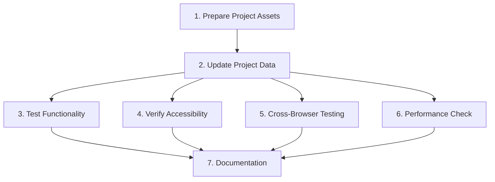

# Tasks: Update Portfolio Projects

## Overview

This task plan covers updating the portfolio projects section, including adding new projects, updating existing ones, and ensuring all functionality works correctly across devices and browsers.

# Implementation Plan:

## 1. Prepare Project Assets
- [x] 1.1 Gather new project images and save to `/public/image/` directory
- [-] 1.2 Verify image file names are lowercase and descriptive
- [~] 1.3 Ensure images are optimized for web (reasonable file size)

## 2. Update Project Data
- [~] 2.1 Add new project entries to the projects array in `Projects.tsx`
- [~] 2.2 Update existing project information if needed (descriptions, tech stacks, links)
- [~] 2.3 Set correct `isCompleted` status for each project
- [~] 2.4 Verify all image paths are correct (relative to `/public/`)
- [~] 2.5 Ensure all URLs (github, live) are valid and accessible

## 3. Test Functionality
- [~] 3.1 Test project display on mobile viewport (< 768px)
- [~] 3.2 Test project display on desktop viewport (≥ 768px)
- [~] 3.3 Verify expandable cards work on mobile (tap to expand/collapse)
- [~] 3.4 Verify tilt effect works on desktop (mouse hover)
- [~] 3.5 Test all external links open correctly in new tabs
- [~] 3.6 Verify images load correctly for completed projects
- [~] 3.7 Verify "In Progress" placeholder shows for incomplete projects
- [~] 3.8 Test skeleton loading animation appears on initial load

## 4. Verify Accessibility
- [~] 4.1 Test keyboard navigation (Tab, Enter, Escape)
- [~] 4.2 Verify focus indicators are visible
- [~] 4.3 Check touch target sizes are minimum 44px on mobile
- [~] 4.4 Verify ARIA attributes are present (aria-expanded, aria-label)

## 5. Cross-Browser Testing
- [~] 5.1 Test in Chrome/Edge
- [~] 5.2 Test in Firefox
- [~] 5.3 Test in Safari (if available)
- [~] 5.4 Test on mobile devices (iOS Safari, Chrome Android)

## 6. Performance Check
- [~] 6.1 Verify animations run smoothly at 60fps
- [~] 6.2 Check image lazy loading works
- [~] 6.3 Verify no console errors or warnings
- [~] 6.4 Test page load time is acceptable

## 7. Documentation
- [~] 7.1 Update README.md if project list has significantly changed
- [~] 7.2 Document any new dependencies or setup requirements

## Tasks

All tasks are listed in the Implementation Plan section above.

## Task Dependency Graph

```json
{
  "waves": [
    {
      "name": "Wave 1: Asset Preparation",
      "tasks": ["1.1", "1.2", "1.3"]
    },
    {
      "name": "Wave 2: Data Update",
      "tasks": ["2.1", "2.2", "2.3", "2.4", "2.5"]
    },
    {
      "name": "Wave 3: Testing & Verification",
      "tasks": ["3.1", "3.2", "3.3", "3.4", "3.5", "3.6", "3.7", "3.8", "4.1", "4.2", "4.3", "4.4", "5.1", "5.2", "5.3", "5.4", "6.1", "6.2", "6.3", "6.4"]
    },
    {
      "name": "Wave 4: Documentation",
      "tasks": ["7.1", "7.2"]
    }
  ]
}
```



## Notes

- The projects array is currently located in `src/components/Projects.tsx`
- Images should be placed in `/public/image/` directory
- The component supports both completed and ongoing projects
- Touch device detection automatically adjusts the UI for mobile vs desktop
- All external links should use `target="_blank"` and `rel="noopener noreferrer"`
